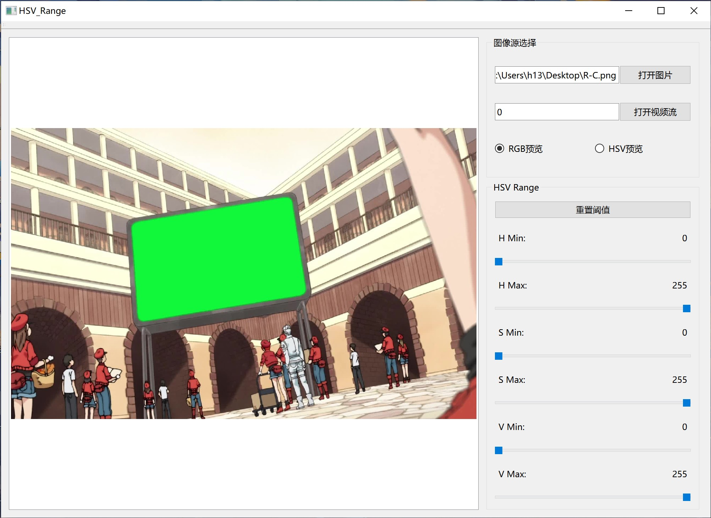
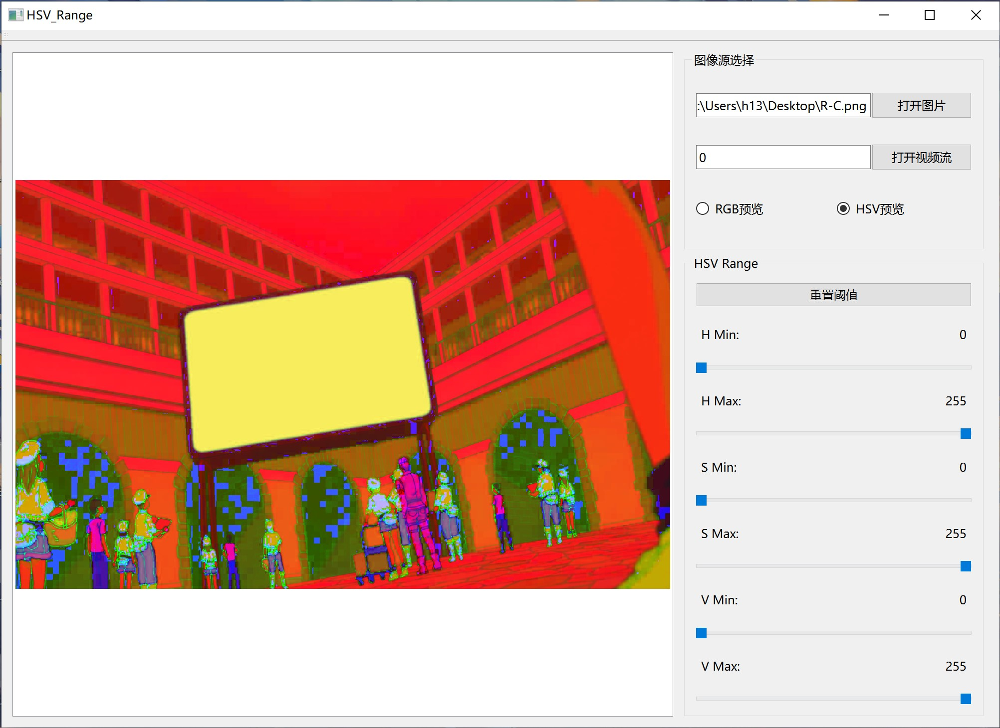
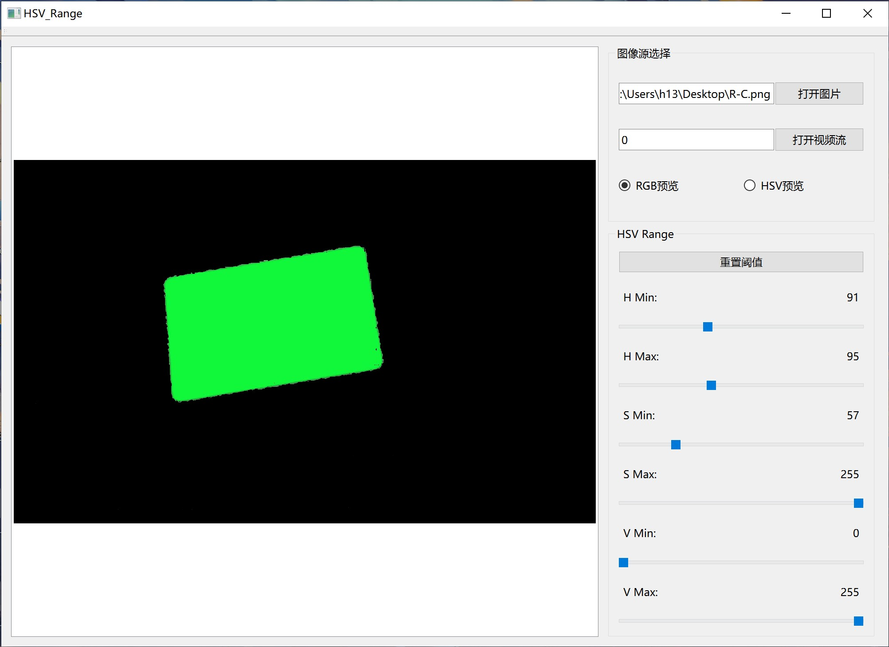

# HSV 阈值编辑器
HSV阈值通常用于OpenCV中的色块识别等。
本Readme包含一些图像, 由于网络问题, 建议使用上网辅助工具查看本文档。
# 使用方法
下载Release版本(暂不提供x86版)
[Release](https://github.com/h13-0/HSV-Range/release)
## 打开图片
参数为文件路径。

### HSV预览
将图片转换为HSV色域预览模式

### 阈值效果

## 打开视频流
参数可以是摄像头ID、视频文件、http视频流等。
